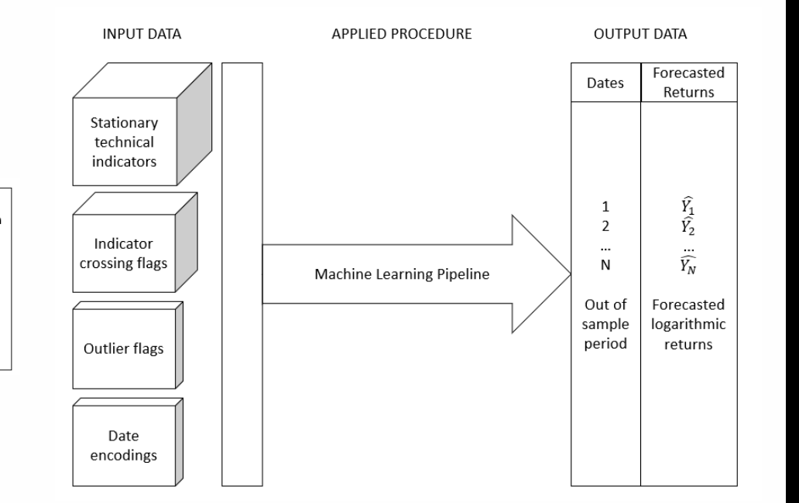
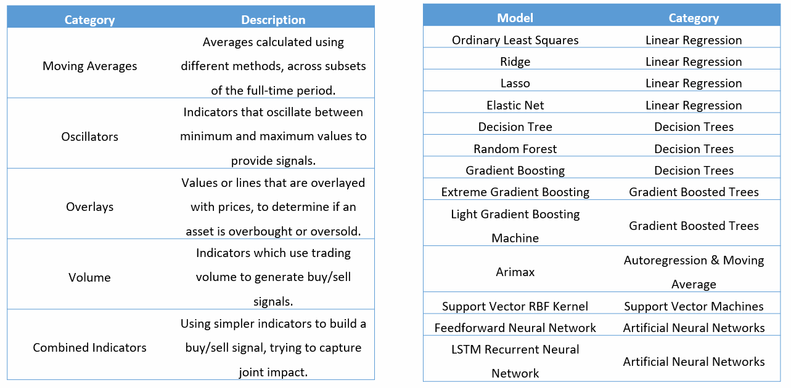

## Comparison of machine learning methods for stock market forecasting

This blog article is a project shocase for my master thesis, which was used to obtain my MSc degree in Kozminski University in 2023. 

You may find the full thesis linked in [this presentation](https://docs.google.com/presentation/d/1ULCPUsf9MZPESIKjZWv-PkV0mSz68Ghv/edit?usp=drive_link&ouid=105147433723649475874&rtpof=true&sd=true), and the GitHub repository is available [here](https://github.com/leonardobocci/ml-stock-market).

The study is conducted under the framework of the adaptive markets hypothesis, and uses technical indicators to forecast daily return data. The same preprocessing pipeline is applied to all algorithms, with a slightly different cross-validation approach used for deep learning methods.

All algorithms are tested against a random walk benchmark, with a scope of G7 markets ETF products. All models approach the forecast as a time series regression problem.



The machine learning pipeline in this study is composed of the following steps:
1. Feature engineering (enforcing stationarity, outlier winsorization, cyclical date encoding, technical indicator crossing boolean flags)
2. Feature scaling (a preliminary comparison of rescaling, normalization and standardization was used to select mean normalization as the best method)
3. Splitting (train/test + walk forward cross validation to prevent time-series specific data snooping into the future)
4. Model training (using RMSE as the loss function)
5. Model evaluation (using a diverse suite of metrics: RMSE, median RAE, % of correct signs, error distribution over time, RMSE vs StDev of true data)

The results of the pipeline are prediction files, for each model and G7 ETF combination, by models trained on stationary technical indicators, boolean flags for indicator conditions, outlier flags and cyclically encodeed date features.

The results bring 2 key takeaways. 
1. More complex models such as LSTM deep networks are unable to outperform simpler ones like random forest regressors and linear regression methods.

2. Some markets can be more easily forecasted than others. More profitable opportunities exist where forecast errors are lower than the standard deviation of true market returns.


For reference, the following image shocases which models were applied, which technical indicators were used to train them, and which market ETFs were forecasted.



**Technically Interesting Details** 

This project was a great learning opportunity to sharpen my skillset in Python for data science. \
All code was executed on Google Colab, and is available in the linked repo. \
However, below are some snippets and explanations of parts of the code that were interesting to me.

1. **Pandas TA for Pythonic generation of financial technical indicators.** 
This library provides a pandas-compatible interface, with the C-powered performance of the talib library. \
It's a great option to generate technical indicators for any sort of financial data, not just stock market (think commodities, crypto, etc.). \
This example adds a column containing an exponential moving average, and crossing flags:

```python
#EMA
df['ema_12'] = df.ta.ema(close=df.close, length=12)
df['ema_26'] = df.ta.ema(close=df.close, length=26)
df.loc[(df.ema_12 > df.ema_26) & (df.ema_12.shift(1) <= df.ema_26.shift(1)), 'ema_cross'] = 1
df.loc[(df.ema_12 < df.ema_26) & (df.ema_12.shift(1) >= df.ema_26.shift(1)), 'ema_cross'] = -1
df.ema_cross.fillna(0, inplace=True)
```

2. **Cyclical encoding for dates**
To capture seasonality and cyclicality of dates, I used a transformation that maps them to sinus and cosinus coordinates, using a library called feature_engine.  
```python
#Cyclical date encoding
from feature_engine.creation import CyclicalFeatures
cyclical = CyclicalFeatures(variables=['day', 'month'])
ta_etfs[etf] = cyclical.fit_transform(ta_etfs[etf])
```

3. **Testing stationarity**
An often overlooked step that increases forecast accuracy and improves convergence during training, it is a bit complex to implement over several steps and ETFs, but boils down to testing for unit root (ADF test) and for a trend (KPSS test). \
This can be done with the statsmodels library.
```python
#Testing stationarity
from statsmodels.tsa.stattools import adfuller
from statsmodels.tsa.stattools import kpss
kpss_list = []
adf_list = []
def kpss_test(timeseries):
    kpsstest = kpss(timeseries, regression="c", nlags='auto')
    kpss_output = pd.Series(
        kpsstest[0:3], index=[
          "Test Statistic",
          "p-value",
          "Lags Used"])
    for key, value in kpsstest[3].items():
        kpss_output["Critical Value (%s)" % key] = value
    if kpss_output['p-value'] < 0.05:
      kpss_list.append(False)
    else:
      kpss_list.append(True)
def adf_test(timeseries):
    dftest = adfuller(timeseries, autolag="AIC")
    dfoutput = pd.Series(
        dftest[0:4],
        index=[
            "Test Statistic",
            "p-value",
            "#Lags Used",
            "Number of Observations Used"])
    for key, value in dftest[4].items():
        dfoutput["Critical Value (%s)" % key] = value
    if dfoutput['p-value'] < 0.05:
      adf_list.append(True)
    else:
      adf_list.append(False)
```

4. **Feature selection**
A really interesting field, with several valid options. The best performing one was unfortunately too expensive computationally, so was not used in the end (genetic selection). Featurewiz was the best compromise I found.
```python
from featurewiz import FeatureWiz
def featurewiz_selection():
  train_features = x_train_scaled.copy()
  test_features = x_test_scaled.copy()
  train_labels = y_train.copy()
  test_labels = y_test.copy()

  features = FeatureWiz(corr_limit=0.70, feature_engg='', category_encoders='', dask_xgboost_flag=False, nrows=None, verbose=0)
  train_features = features.fit_transform(train_features, train_labels)
  test_features = features.transform(test_features)
  return train_features, test_features
```

5. **Time series cross validation**
For time series data, random folds in cross validation are inappropriate, because they give the model information about the future. This is solved by walk-forward validation.
```python
from tscv import GapRollForward
def run_cross_val(estimator, parameters):
  splitter_size = int(0.16*len(x_train_scaled))
  splitter = GapRollForward(gap_size=0, min_test_size=splitter_size, min_train_size=splitter_size, max_test_size=splitter_size)
  cv = GridSearchCV(estimator=estimator, param_grid=parameters, cv=splitter, scoring='neg_mean_squared_error')
  cv.fit(x_train_scaled, y_train.values.ravel())
  params = pd.DataFrame(cv.best_params_, index=[0])
  return params
```

6. **Training LSTM Networks**
These powerful recurrent deep networks didn't prove great for this use case. \
They are nonetheless very interesting, but their training is not the easiest to set up.
I used neptune.ai to track my experiments. They can be found [here](https://app.neptune.ai/o/ku-master-research/org/master-thesis-lstm/runs/table?viewId=98c80e99-2e46-412b-b8c0-a64f6b47e16f).
The experimentation came down to testing various settings of window size, learning rate, epochs, recurrent units, hidden layers, dropout values, decay and norm clipping.
The important thing was preparing the data into the format expected by LSTM: a 3d matrix (n_samples x timesteps x n_features), with windows of a certain length for historical context.
```python
def prep_lstm_data():
  #Create windows for the training data
  for i in range(window_size, len(x_train_scaled) - n_future +1):
      train_features.append(x_train_scaled.iloc[i - window_size:i, 0:x_train_scaled.shape[1]])
      train_labels.append(y_train.iloc[i + n_future - 1:i + n_future, 0])
  train_features, train_labels = np.array(train_features), np.array(train_labels)

  #Add the periods of the training data that are part of the required window length to the test data
  x_test_lstm = pd.concat([x_train_scaled.iloc[len(x_train_scaled)-window_size:,:], x_test_scaled]).reset_index(drop=True)

  #Create windows for the testing data
  for i in range(window_size, len(x_test_lstm) - n_future +1):
      test_features.append(x_test_lstm.iloc[i - window_size:i, 0:x_test_lstm.shape[1]])
      test_labels.append(y_test.iloc[i-window_size: i- window_size+1, 0])
  #Convert inputs to Tensors
  test_features, test_labels = np.array(test_features), np.array(test_labels)
  train_features = tf.convert_to_tensor(train_features) #train_features, scaled
  test_features = tf.convert_to_tensor(test_features) #test_features, scaled
  train_labels = tf.convert_to_tensor(train_labels) #train_labels
  test_labels = tf.convert_to_tensor(test_labels) #test_labels
  return train_features, test_features, train_labels, test_labels
```