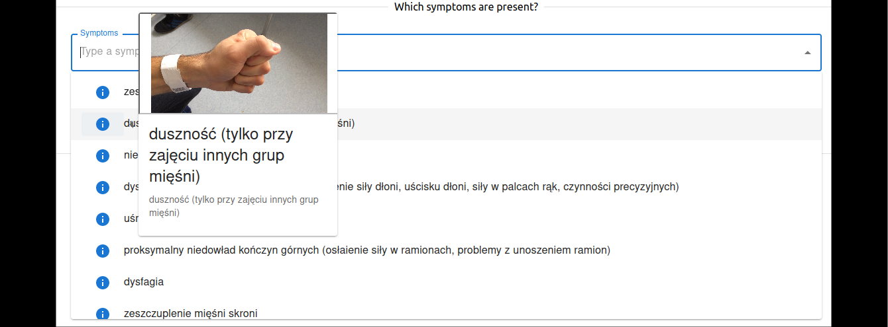
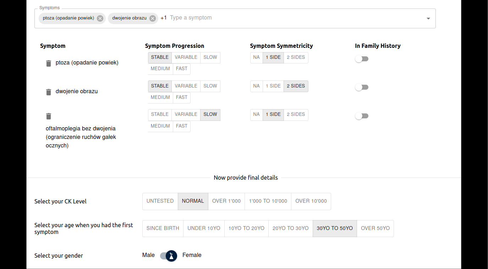
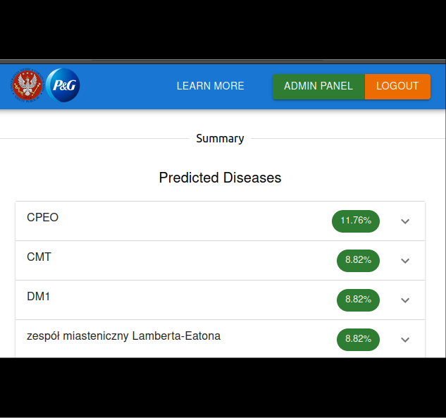

## Neurological disease prediction web app

The tool was built as a full-stack web app, to allow doctors, patients or anyone else to self-diagnose rare neurological diseases based on symptom selections. All the code is open-sourced on our [Github repo](https://github.com/Ahmed-Haitham/CE-IT-Hub-Hackathon-2024).

The Hackathon lasted 3 working days, so the web app is a minimum viable product and several features could be refined to improve the functionality.

Some notable requirements which we considered when defining our approach were: ability to keep all the tool's knowledge base in Excel and upload it, requirement to host the tool on an on-prem server owned by Warsaw Medical University.

So, with that in mind, the stack we used is:

<b>Infra</b>: Docker compose (frontend container, api container, db container) \
<b>Backend</b>: Python with FastApi, SqlAlchemy interacting with PostgreSQL \
<b>Frontend</b>: React with MaterialUI


**Technically Interesting Details** 

I loved the chance to get my hands dirty with full-stack development for the first time. \
Here are some learnings that I got from the experience.

1. **FastAPI and Pydantic are a great choice** 
These libraries make building API functionality a breeze, and provide schema validations out of the box, with a great developer experience. \
The example here shows how simple the creation of an endpoint to query the list of symptoms from the database is, using async for performance.

```python
#An example endpoint to list symptoms, calling an async function
#[main.py]
@app.get("/symptoms", response_model=list[schemas.SymptomDefinitions])
async def list_symptoms(search_for: str | None = None, db: AsyncSession = Depends(get_session)):
    client = SymptomDefinitionsClient(db)
    return await client.list_symptoms(search_for)

...
#[crud.py]
class SymptomDefinitionsClient():
    def __init__(self, session: AsyncSession):
        self.session = session
    async def list_symptoms(self, search_for: str, skip: int = 0, limit: int = 1000):
        statement = select(models.SymptomDefinitions)
        if search_for:
            statement = statement.filter(
                models.SymptomDefinitions.symptom_name.ilike('%' + search_for + '%')
            )
        statement = statement.offset(skip).limit(limit)
        result = await self.session.scalars(statement)
        result.unique()
        return result.all()
```

2. **Sqlalchemy not so much :(**
While SqlAlchemy is undoubtedly powerful and feature-rich, its documentation is very confusing, with several styles available to do the same things, and plenty of deprecated approaches still floating around in documentation and stackoverflow. \
If we had to do it again, we'd choose something else like Piccolo or Tortoise, which are async-native and would have left us enough time to properly define our relationships instead of having a one-big-table approach. \
The following is our main sqlalchemy model object.
```python
class OneBigTable(Base):
    __tablename__ = "big_table"

    id = Column(Integer, default=None, primary_key=True)
    symptom_medical_name = Column(String(128), nullable=False)
    symptom_description = Column(String(5000))
    symptom_is_red_flag = Column(Boolean, default=False)
    symptom_symmetricity = Column(
        Enum(SymmetricityChoices), default="na", nullable=False
    )
    symptom_progression = Column(Enum(ProgressionChoices), nullable=False)
    first_symptom_age_onset_group = Column(Enum(OnsetChoices), nullable=False)
    symptom_media_path = Column(String(5000))
    symptom_tags = Column(ARRAY(String), nullable=False)

    disease_group_medical_name = Column(String(128), nullable=False)  # , unique=True
    disease_group_summary_message = Column(String(5000), nullable=False)

    test_ck_level = Column(Enum(CkLevelChoices), default="not_tested")

    gender = Column(Enum(GenderChoices), nullable=False)
```

3. **GenAi is good at front-end development**
As we didn't have a front-end developer in our team, we had to improvise. \
Learning to building a React web-app from scratch in a weekend was challenging, but really fun. \
With some help from Github copilot, we are very happy with our final result, considering our lack of experience. \
Our app works as follows: \
First, you select your symptoms through the searchable dropdown with media support on hover: \

Then, you add additional symptom and test details: \

When ready, you submit the assessment. The selections are packed into a post request body, returning a list of predicted disease groups, ranked by probability: \


Behind the scenes, there are a few endpoints to do the job, including a protected (JWT-token-based login) one for the file upload in an admin panel.


